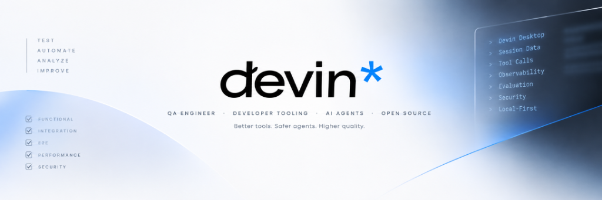
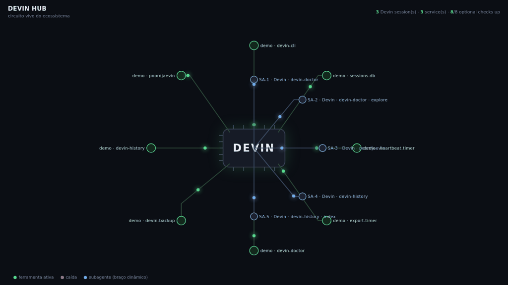

<picture>
  <source media="(prefers-color-scheme: dark)" srcset="assets/banner-dark.png"/>
  
</picture>

<h1><a href="https://www.linkedin.com/in/ícaro-galvão-do-nascimento-663601280/">Ícaro Galvão</a></h1>

I build tools that make AI coding agents easier to inspect, evaluate and trust.
Currently building 19 public `devin-*` tools for Devin's local session data,
with a separate profile-based DevKit distribution, maintainer hub and related
artifacts listed in the catalog.

[Website](https://icaro0310.github.io) · [LinkedIn](https://www.linkedin.com/in/ícaro-galvão-do-nascimento-663601280/) · [Catalog](#catalog)

## Start here

New to the ecosystem? Follow the shortest path:

1. [`devin-doctor`](https://github.com/Icaro0310/devin-doctor) — diagnose the local Devin install and confirm the stores are healthy.
2. [`devin-qa-pack`](https://github.com/Icaro0310/devin-qa-pack) — the flagship audit: verify what an agent claimed against tool-call evidence.
3. [`devin-office`](https://github.com/Icaro0310/devin-office) — watch live sessions, subagents and tools as an animated circuit board.
4. [`awesome-devin`](https://github.com/Icaro0310/awesome-devin) — browse the curated hub for every tool, guide and related resource.

## Selected work

Six projects that show the product path — **diagnose → audit → watch → understand → evaluate → protect**:

| | | |
|---|---|---|
| [`devin-qa-pack`](https://github.com/Icaro0310/devin-qa-pack) | **Audit the agent** | Flagship evidence gate — PASS / PARTIAL / UNVERIFIED from recorded tool calls |
| [`devin-doctor`](https://github.com/Icaro0310/devin-doctor) | **Diagnose the install** | `brew doctor` for Devin's local stores, schema, locks, config and disk |
| [`devin-office`](https://github.com/Icaro0310/devin-office) | **Watch the runtime** | Live sessions, subagents and tools rendered as an animated circuit board |
| [`devin-internals-spec`](https://github.com/Icaro0310/devin-internals-spec) | **Understand the system** | Devin's local stores, documented — schema detection, typed parsers, contract boundary against drift |
| [`devin-evals`](https://github.com/Icaro0310/devin-evals) | **Evaluate quality** | Replay recorded sessions against deterministic rubrics; agent quality as a regression signal |
| [`devin-redact`](https://github.com/Icaro0310/devin-redact) | **Protect the evidence** | Secret/PII redaction that understands tool-call semantics before exports leave the machine |

**devin-office** — live sessions, subagents and tools as an animated circuit board · [open the live demo](https://icaro0310.github.io/demos/devin-office.html)

## Install the ecosystem

One registry ([`devin-powerups`](https://github.com/Icaro0310/devin-powerups)) is
the source of truth; [`devin-devkit`](https://github.com/Icaro0310/devin-devkit)
is the distribution layer that installs it under three declared environments:

| Environment | Runtime | Install |
|---|---|---|
| **Linux** | Extended | `devin-devkit install full --environment linux` |
| **Personal Windows** | Extended | `devin-devkit install full --environment personal-windows` |
| **Corporate Windows** | Local-only | `devin-devkit install full --environment corporate-windows` |

Extended mode runs locally plus optional Devin VM/QwenPaw delegation where a
tool supports it. Corporate Windows is **local-only**: no VM, QwenPaw, Slack
dependency, external compute or workload delegation — and it is selected
explicitly, because the OS alone cannot distinguish a personal Windows machine
from a restricted one. The registry records per-tool compatibility; the DevKit
previews the plan before installing (`--apply` to commit).

<!-- DEVIN-CATALOG:BEGIN -->

<b>The ecosystem — 19 first-party tools · 1 distribution layer · 1 registry hub · 3 related artifacts (24 entries)</b>

 

| Group | Repo | What it does |
|---|---|---|
| **Foundation** | [`devin-internals-spec`](https://github.com/Icaro0310/devin-internals-spec) | Documented internals of Devin Desktop/CLI stores + schema-version detection + fixtures + devin-inspect CLI. |
| **Security** | [`devin-redact`](https://github.com/Icaro0310/devin-redact) | Secret/PII redaction that understands Devin tool-call semantics, in-place in SQLite, with a verification gate. |
| **Operations** | [`devin-history`](https://github.com/Icaro0310/devin-history) | Export and audit Devin session history — markdown notes, JSON, CSV, Obsidian-ready. |
| **QA** | [`devin-doctor`](https://github.com/Icaro0310/devin-doctor) | Diagnose a Devin Desktop installation: stores, schema, locks, config, disk — with fix suggestions. |
| **Operations** | [`devin-pm`](https://github.com/Icaro0310/devin-pm) | Project manager over sessions: per-repo rollups, milestones, status reports, registry.json. |
| **QA** | [`devin-qa-pack`](https://github.com/Icaro0310/devin-qa-pack) | Flagship QA audit: verifies session deliverable claims against tool-call ground truth and reports PASS/PARTIAL/UNVERIFIED. |
| **Evaluation** | [`devin-metrics`](https://github.com/Icaro0310/devin-metrics) | Local-only session observability: activity, context size, and token peaks per project/model/day; zero telemetry. Devin does not persist cost fields, so cost is not claimed. Includes an optional dashboard subpackage and command. |
| **Operations** | [`devin-backup`](https://github.com/Icaro0310/devin-backup) | Safe snapshot/verify/restore/rotate of Devin stores with schema-version manifests. |
| **Memory** | [`devin-search`](https://github.com/Icaro0310/devin-search) | FTS5 full-text search across all Devin sessions, role-tagged and project-filtered. |
| **Memory** | [`devin-graph`](https://github.com/Icaro0310/devin-graph) | Knowledge graph: sessions, projects, files touched, tools used — queryable edges. |
| **Evaluation** | [`devin-evals`](https://github.com/Icaro0310/devin-evals) | Deterministic eval harness: replay recorded sessions against rubric graders. |
| **Memory** | [`devin-memory`](https://github.com/Icaro0310/devin-memory) | Anti-poisoning memory store: provenance, versioning, quarantine gate, and session-learning utilities. |
| **Security** | [`devin-janitor`](https://github.com/Icaro0310/devin-janitor) | Session lifecycle janitor: export-then-delete pipeline, tiered classification, pluggable judge, pending-retry for locked stores. |
| **Security** | [`devin-bridge`](https://github.com/Icaro0310/devin-bridge) | Policy-gated ACP client (Node.js, CI matrix Node 22 + 24): isolated sessions per repo with allow/deny/ask permission policy. |
| **Operations** | [`devin-orchestrator`](https://github.com/Icaro0310/devin-orchestrator) | Background-worker fan-out policy: deterministic planner enforcing worker caps (max 3), no nesting, read-only profiles for review, collect-before-report. Skill + always-on rule. |
| **Operations** | [`devin-office`](https://github.com/Icaro0310/devin-office) | Local-first Devin session and subagent dashboard with standalone and optional split modes. |
| **Evaluation** | [`devin-dream`](https://github.com/Icaro0310/devin-dream) | Synthetic Devin sessions with known verdicts — labeled defects (D01-D09), adversarial inject mode, and fleet generation. Regression/adversarial test data for the catalog. |
| **Governance** | [`devin-switch`](https://github.com/Icaro0310/devin-switch) | Switch between Devin configuration profiles (hooks, MCP, models) with snapshot, sha256 verify, atomic write, journal and rollback. Dry-run by default; secrets never printed. |
| **Governance** | [`devin-skill-catalog`](https://github.com/Icaro0310/devin-skill-catalog) | Lifecycle + quality gates for .devin skills/rules: scan, lint, diff, G1/G2 gates, quarantined→approved→active lifecycle, sha256-verified export/import bundles (imports land quarantined). |
| **Distribution** | [`devin-devkit`](https://github.com/Icaro0310/devin-devkit) | Profile-based installer for the public Devin tools across Linux, Personal Windows and Corporate Windows; reads the registry manifest and installs isolated CLIs with uv, plus the Node bridge with npm. |
| **Maintainer hub** | [`devin-powerups`](https://github.com/Icaro0310/devin-powerups) | Public maintainer hub: registry, roadmap, project template, scaffolder, release checks, and community catalog generators. |
| **Related Suite** | [`qwenpaw-suite`](https://github.com/Icaro0310/qwenpaw-suite) | Optional QwenPaw add-on for self-hosted model operators. Includes the local-model bridge, health checks, and GitHub/local documentation sync. |
| **Related Tool** | [`poordjaevin`](https://github.com/Icaro0310/poordjaevin) | Djævin: fork of poordjaevin adding a Devin ACP backend (uses the model Devin already runs, no extra download); local NLI backend stays as fully-offline fallback. |
| **Related Resource** | [`awesome-devin`](https://github.com/Icaro0310/awesome-devin) | Curated awesome-list of Devin tooling and resources (CC0). |
<!-- DEVIN-CATALOG:END -->

## The method

Every project adapts an existing, proven tool **plus** one Devin-specific extra
that must pass three tests:

1. does something the base tool *cannot* do
2. the extra disappears without Devin
3. explainable in one sentence

All tools are **read-only by default** on Devin's local stores and send
**zero telemetry**.

## Runs on Devin alone?

Yes — **no VM, no tunnel, no model server, no Slack, no Obsidian.** The
DevKit-installable catalog still works on a locked-down corporate machine.
The exceptions are explicit in the registry: `devin-bridge` needs Node.js
≥ 20 (it is an ACP client for the Devin CLI itself); `poordjaevin` has a
fully offline NLI fallback; `qwenpaw-suite` is an optional related suite and
is unsupported in Corporate Windows.

**Linux:** `pipx install "devin-doctor @ git+https://github.com/Icaro0310/devin-doctor.git"` —
requires Python ≥ 3.10.
**Windows:** same via `py -m pip install --user pipx`. Each README documents
the exact data paths and `--data-dir` overrides for both systems.

## Runs on a personal machine?

The catalog composes into a standing **agent runtime** when the machine is
yours. Each optional piece adds one capability — none is required:

| Optional piece | What it adds |
|---|---|
| **Hooks** (`SessionEnd`, `Stop`, `UserPromptSubmit`) | Automatic history export and lesson extraction after every session |
| **An MCP memory store** | Decisions and conventions that survive across sessions |
| **A notes vault** (e.g. Obsidian) | Curated long-term memory — decisions, learnings, transcripts |
| **A scheduler** (cron / Task Scheduler) | Periodic checklists — heartbeat, janitor, scheduled reports |
| **A comms channel** (e.g. Slack) | Talk to the agent and get notified remotely |
| **`poordjaevin` as judge** | Cheap yes/no/rate answers — via Devin's own model (ACP), or a fully offline local model |

### On a corporate machine

On a locked-down machine the catalog runs **on demand** and most of the
runtime can still be reconstructed locally:

- **Memory and learning are unaffected.** Hooks are event-driven
  (`UserPromptSubmit`, `Stop`, `SessionEnd`), so prompt logging, lesson
  extraction and history export keep working without any scheduler. The
  MCP memory store and `learned-*` skills only need a writable Devin
  config directory.
- **Proactivity is mostly recoverable.** Instead of a cron heartbeat,
  elapsed-time checks can piggyback on `UserPromptSubmit` — a checklist
  runs whenever you are active, which is when it matters. A persistent
  background loop (`while sleep; do devin acp …`) is equivalent while the
  machine is on.
- **Outbound restrictions are a non-issue** — nothing in the catalog makes
  a network call.

What a corporate machine genuinely cannot provide:

- **Wake-while-idle.** With no scheduler and the session closed, nothing
  ticks — a suspended laptop has no heartbeat.
- **Remote reach.** Without Slack (or any comms channel), the agent can
  detect something urgent but cannot reach you. Deferred notification —
  flag files read on your next prompt — works, but late.
- **Offload.** Heavy work (browser automation, builds) runs locally and
  competes for the machine's RAM.
- **Multi-machine topology.** No tunnel means `devin-office` probes and
  hubs are confined to loopback.

The runtime is an enhancement, never a dependency — roughly 90% of it
survives a locked-down machine.

## Windows and Linux documentation

The public tools target Linux, Personal Windows and Corporate Windows. Shared
purpose and usage stay in `README.md`; each repository's Windows and Linux
guides carry platform-specific installation, Devin paths, PATH setup,
scheduling, and troubleshooting. The DevKit additionally documents the
corporate local-only mode and a registry-generated compatibility matrix.
macOS is planned but not yet claimed as tested.

---

Devin is a trademark of Cognition AI. Community project — not affiliated.

